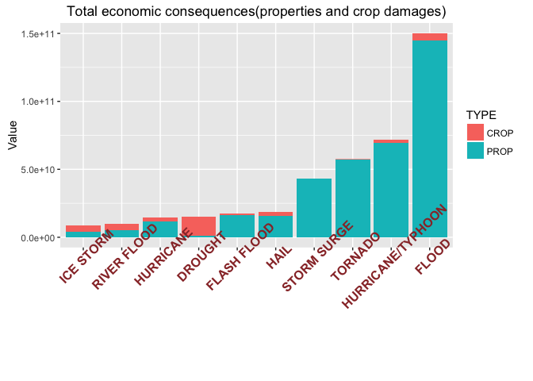

# Economic and Health Consequences of Severe Weather Events

## Synopsis

Storms and other severe weather events can cause both public health and economic problems for communities and municipalities. The scope is to decide which events are most harmful. This report explores the U.S. National Oceanic and Atmospheric Administration's (NOAA) storm database. This database tracks characteristics of major storms and weather events in the United States, including when and where they occur, as well as estimates of any fatalities, injuries, and property damage. 


## Data Processing

Libraries used

```r
library(ggplot2)
library(dplyr)
```


```r
if(!file.exists("projectdata.csv.bz2")){
  fileUrl <- "https://d396qusza40orc.cloudfront.net/repdata%2Fdata%2FStormData.csv.bz2"
  download.file(fileUrl, destfile = "projectdata.csv.bz2", method = "curl")
}
projectdata <- read.csv("projectdata.csv.bz2")
```
### Health consequences
Summarize health problems(FATALITIES, INJURIES) by event type, removing events whith no consequences.

```r
sumFatalities <- projectdata %>%
            group_by(EVTYPE) %>%
            summarize(consequences = sum(FATALITIES)) %>%
            filter(consequences != 0) %>% 
            mutate(TYPE='FATALITY')


sumInjuries <- projectdata %>%
            group_by(EVTYPE) %>%
            summarize(consequences = sum(INJURIES)) %>%
            filter(consequences != 0) %>% 
            mutate(TYPE='INJURY')

healthProblems <- rbind(sumFatalities, sumInjuries)
```
How many events produce fatalities?


```r
nrow(sumFatalities)
```

```
## [1] 168
```
How many events produce injuries?


```r
nrow(sumInjuries)
```

```
## [1] 158
```
As there are too many events with consequences, only first 10 most devastating events are ploted.

```r
healthProblemsMost <- healthProblems %>%
            group_by(EVTYPE) %>%
            summarize(consequences = sum(consequences)) %>%
            arrange(-consequences) %>%
            top_n(10)
```

```
## Selecting by consequences
```
Select events by type, but only most imporant. Also, reorder events.

```r
healthProblemsMostByType <- healthProblems %>%
                            filter(EVTYPE %in% healthProblemsMost$EVTYPE)

healthProblemsMostByType$EVTYPE <- factor(healthProblemsMostByType$EVTYPE, levels = healthProblemsMost$EVTYPE[order(healthProblemsMost$consequences)])
```
### Economic consequences
Calculate real demage value

```r
projectdata <- projectdata %>%
  mutate(PropertyDamage = ifelse(toupper(PROPDMGEXP) =='K', yes = PROPDMG*1000, ifelse(toupper(PROPDMGEXP) =='M', PROPDMG*1000000, ifelse(toupper(PROPDMGEXP) == 'B', PROPDMG*1000000000, ifelse(toupper(PROPDMGEXP) == 'H', PROPDMG*100, PROPDMG))))) %>%
  mutate(CropDamage = ifelse(toupper(CROPDMGEXP) =='K', CROPDMG*1000, ifelse(toupper(CROPDMGEXP) =='M', CROPDMG*1000000, ifelse(toupper(CROPDMGEXP) == 'B', CROPDMG*1000000000, ifelse(toupper(CROPDMGEXP) == 'H', CROPDMG*100, CROPDMG)))))
```
Select events with most impact on economic situation of the communities. Reorder them so that most demaging events are shown.


```r
sumProp <- projectdata %>%
            group_by(EVTYPE) %>%
            summarize(consequences = sum(PropertyDamage)) %>%
            filter(consequences != 0) %>% 
            mutate(TYPE='PROP')


sumCrop <- projectdata %>%
            group_by(EVTYPE) %>%
            summarize(consequences = sum(CropDamage)) %>%
            filter(consequences != 0) %>% 
            mutate(TYPE='CROP')

economicProblems <- rbind(sumProp, sumCrop)


economicProblemsMost <- economicProblems %>%
            group_by(EVTYPE) %>%
            summarize(consequences = sum(consequences)) %>%
            arrange(-consequences) %>%
            top_n(10)
```

```
## Selecting by consequences
```

```r
economicProblemsMost
```

```
## Source: local data frame [10 x 2]
## 
##               EVTYPE consequences
##               (fctr)        (dbl)
## 1              FLOOD 150319678257
## 2  HURRICANE/TYPHOON  71913712800
## 3            TORNADO  57352114049
## 4        STORM SURGE  43323541000
## 5               HAIL  18758222016
## 6        FLASH FLOOD  17562129167
## 7            DROUGHT  15018672000
## 8          HURRICANE  14610229010
## 9        RIVER FLOOD  10148404500
## 10         ICE STORM   8967041360
```

```r
economicProblemsMostByType <- economicProblems %>%
                            filter(EVTYPE %in% economicProblemsMost$EVTYPE)

economicProblemsMostByType
```

```
## Source: local data frame [20 x 3]
## 
##               EVTYPE consequences  TYPE
##               (fctr)        (dbl) (chr)
## 1            DROUGHT   1046106000  PROP
## 2        FLASH FLOOD  16140812067  PROP
## 3              FLOOD 144657709807  PROP
## 4               HAIL  15732267543  PROP
## 5          HURRICANE  11868319010  PROP
## 6  HURRICANE/TYPHOON  69305840000  PROP
## 7          ICE STORM   3944927860  PROP
## 8        RIVER FLOOD   5118945500  PROP
## 9        STORM SURGE  43323536000  PROP
## 10           TORNADO  56937160779  PROP
## 11           DROUGHT  13972566000  CROP
## 12       FLASH FLOOD   1421317100  CROP
## 13             FLOOD   5661968450  CROP
## 14              HAIL   3025954473  CROP
## 15         HURRICANE   2741910000  CROP
## 16 HURRICANE/TYPHOON   2607872800  CROP
## 17         ICE STORM   5022113500  CROP
## 18       RIVER FLOOD   5029459000  CROP
## 19       STORM SURGE         5000  CROP
## 20           TORNADO    414953270  CROP
```

```r
economicProblemsMostByType$EVTYPE <- factor(economicProblemsMostByType$EVTYPE, levels = economicProblemsMost$EVTYPE[order(economicProblemsMost$consequences)])
```
It can be seen that the weight of properties damage is bigger that the crop damage. Which events produce most damage for properties and which for crop?


```r
sumPropMax <- sumProp %>%
              arrange(-consequences) %>%
              top_n(10, consequences)

sumCropMax <- sumCrop %>%
              arrange(-consequences) %>%
              top_n(10, consequences)
sumCropMax
```

```
## Source: local data frame [10 x 3]
## 
##               EVTYPE consequences  TYPE
##               (fctr)        (dbl) (chr)
## 1            DROUGHT  13972566000  CROP
## 2              FLOOD   5661968450  CROP
## 3        RIVER FLOOD   5029459000  CROP
## 4          ICE STORM   5022113500  CROP
## 5               HAIL   3025954473  CROP
## 6          HURRICANE   2741910000  CROP
## 7  HURRICANE/TYPHOON   2607872800  CROP
## 8        FLASH FLOOD   1421317100  CROP
## 9       EXTREME COLD   1292973000  CROP
## 10      FROST/FREEZE   1094086000  CROP
```

```r
propCropMax <- rbind(sumPropMax, sumCropMax)

propCropMaxSum <- propCropMax %>%
            group_by(EVTYPE) %>%
            summarize(consequences = sum(consequences)) 

propCropMax$EVTYPE <- factor(propCropMax$EVTYPE, levels = propCropMaxSum$EVTYPE[order(propCropMaxSum$consequences)])
```

## Results

### Across the United States, which types of events are most harmful with respect to population health?


```r
 ggplot(data=healthProblemsMostByType, aes(x=EVTYPE, y=consequences, fill=TYPE)) + geom_bar(stat = "identity") + theme(axis.text.x = element_text(face="bold", color="#993333", size=12, angle=45)) + ylab("") + labs(title="Effect on population health")
```

<!-- -->

### Across the United States, which types of events have the greatest economic consequences?


```r
 ggplot(data=economicProblemsMostByType, aes(y=consequences, x=EVTYPE, fill=TYPE)) + geom_bar(stat = "identity") + theme(axis.text.x = element_text(face="bold", color="#993333", size=12, angle=45)) + ylab("Value") + xlab("") + labs(title="Total economic consequences(properties and crop damages)")
```

<!-- -->


```r
 ggplot(data=propCropMax, aes(y=consequences, x=EVTYPE, fill=TYPE)) + geom_bar(stat = "identity", position = "dodge") + theme(axis.text.x = element_text(face="bold", color="#993333", size=12, angle=45)) + ylab("Value") + xlab("") + labs(title="Most demaging events for properties and crops")
```

<!-- -->

## Summary
**Tornadoes** are most demaging event in the US in terms of people health. In economic perspective, **floods** are most demaging events, followed by **hurricanes** and **tornadoes**. When looking deeply in the economic efects, **drought** can be highlited as most demaging event for crop.
